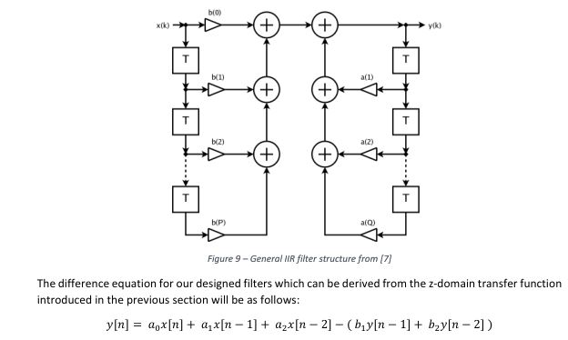
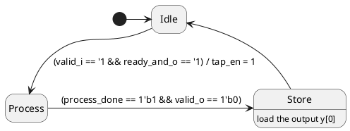
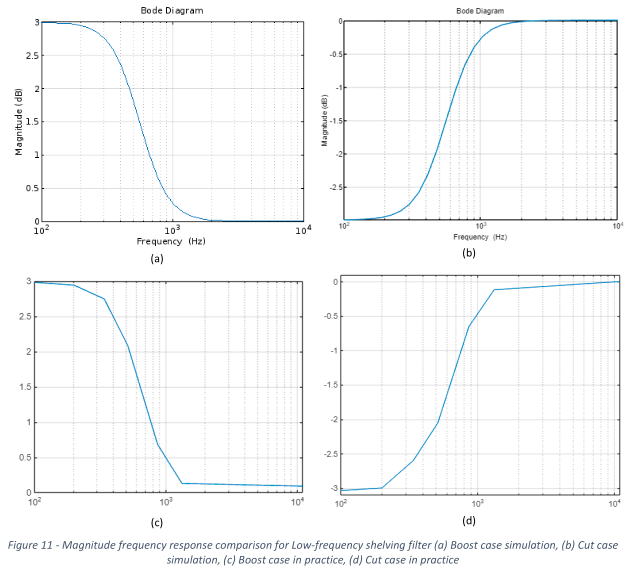

# IIR/FIR Filter RTL Design and Verification
This project aims to provide high-quality, open-source and comprehensively verified parameterizable IIR/FIR filter IP written in Systemverilog, suitable for ASIC and FPGA applications. It can also be used for educational purposes to learn more about concepts such as RTL development of DSP algorithms and also can serve as an example for learning about UVM methodology with free open-source tools. 

## Table of Contents
- [Deliverables](#deliverables)
- [Required Tools](#required-tools)
- [How to run the simulations](#how-to-run-the-simulations)
- [Test results](#test-results)
- [RTL Verification status](#rtl-verification-status)
- [Details about RTL design decisions](#details-about-rtl-design-decisions)
- [C model verification against the Matlab](#c-model-verification-against-the-matlab)

## Deliverables
- Parameterizable Systemverilog RTL source code for the IIR IP
- UVM testbench written in Systemverilog compatible with industrial simulation tools
- A more comprehensive UVM testbench written in Python, compatible with cocotb and open-source simulators
- Floating-point and bit-exact C model used for functional verification of the algorithm

- Parameterizable Systemverilog RTL source code for the FIR IP *(currently verification suite isn't available for it, but it can be made available based on demand)

## Required Tools
- In order to run the Systemverilog UVM testbench you will need a simulation tool that fully supports UVM, the provided testbench has been tested with Xcelium and CDNS-UVM-1.1d (24.03-s001) library

- The Python UVM testbench is written for open-source testbench framework, cocotb, and can be used with simulators that are under cocotb's support. So far it's been used with Verilator.
  
  - Verilator 5.042 2025-11-02 [Installation guide](https://verilator.org/guide/latest/install.html#)
  - cocotb 2.0.0 [Installation guide](https://docs.cocotb.org/en/stable/install.html)

  - In order to be able to also view the waves from the simulator, the open-source tool [GTKWave](https://github.com/gtkwave/gtkwave) can be used.
  
  - And here is the main Python libraries used for running the testbench in UVM methodology:
  
      - [pyuvm 4.0.1](https://github.com/pyuvm/pyuvm)
      - [pyvsc 0.9.4](https://github.com/fvutils/pyvsc)

## How to run the simulations
For my personal work flow I have developed a Makefile that can be used to build the project, I have carried out the development on an Ubuntu 24.04.2 LTS operating system. If you have an already running flow for simulating RTL, the source files could just be dragged and dropped into your flow otherwise if you are interested in my personal flow, given that the tools are setup for you similar to my setting, here are set of commands that can be used to make the simulations.

- For the Systemverilog UVM simulation with xcelium, I have used docker to containerized my runs and different Testcases can be run with these commands:
    - `make create_container CONTAINER_NAME=xc_env_cnt2`
    - `make run_container TESTCASE=test_cosnt_coeff GUI=0 CONTAINER_NAME=xc_env_cnt2 XCE_SEED=12345`
  
  - If you are not using docker, you could just directly run this command:
      - `make compile_xcelium_tb TESTCASE=test_rand_coeff GUI=0 XCE_SEED=12345`

- For running the Python testbench in batch mode, you can use the target below:
  - `make cocotb PY_TESTCASE=test_rand_coeff COCOTB_SEED=12345`

  - In order to collect and view the waves from simulation, you can run this target:
      - `make gtkwave PY_TESTCASE=test_rand_coeff COCOTB_SEED=12345`

- In order to run regression runs you can use the targets below:
  - `make regression_sv_uvm`
  - `make regression_coco`
  - `make regression_all`

## Test results
The test results from regression runs can be found under test-results folder, the results are compatible with JUnit format and ready to be used in a CI/CD flow! The respective coverage results can also be found under coverage_report. 

## RTL Verification status
The main testbench for verification of this IP is the one which is written in Python and can be run with other open-source tools. Provided testsuite for Python testbench passes 100% line coverage with Verilator and different functional aspects of the design have been stressed. The testbench is self-checking and results are compared against a C model implementation of the design. Below is the list of testcases that were created for the design:

- `test_const_coef`
- `test_rand_coeff`
- `test_rand_coeffbackpress`
- `test_rand_coeffbackpress_mid_reset`
- `test_rand_valid`
- `test_saturation`
- `test_process_delay`

## Details about RTL design decisions

### Datapath architecture

### Controlpath architecture

- The state machine is a mixture of Mealy and Moore, since for minimum latency I wanted to load in the data into the taps asap
- The ready/valid signals on both input and output interface work cooperatively.

## C model verification against the Matlab
In order to verify the C model functionality, the outputs from the model was compared against the Matlab model. So first specific coefficients were selected and for those specific coefficients the bode diagram was plotted in Matlab and then same objective was pursued for the C model (with floating-point implementation) but with limited data points and sampling rate. The result is brought in below:

